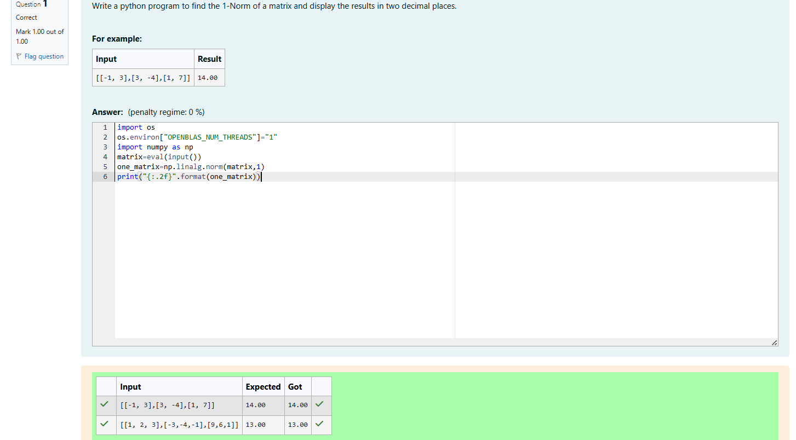
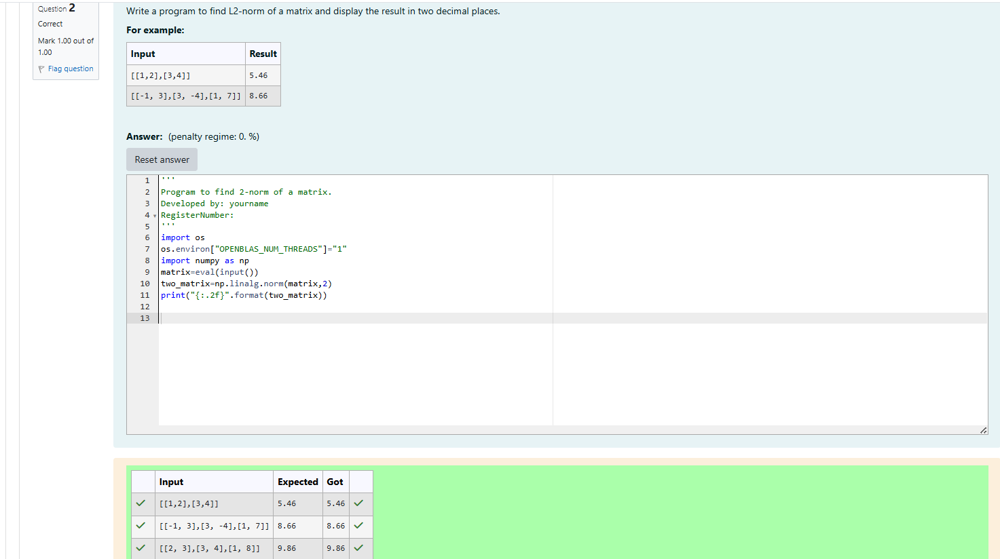
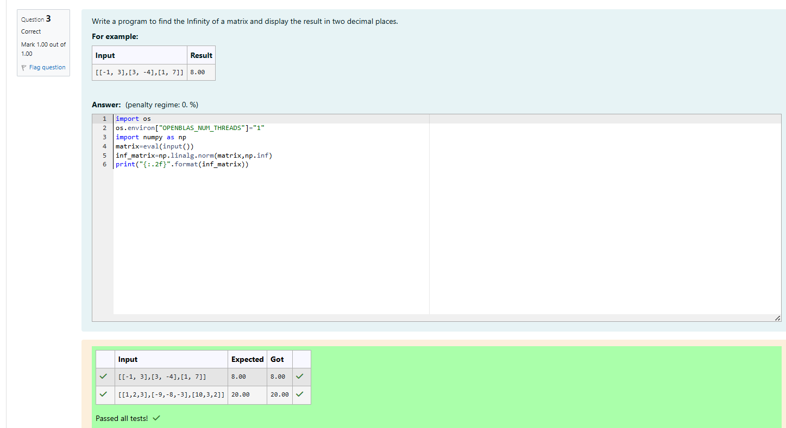

# Norm of a matrix
## Aim
To write a program to find the 1-norm, 2-norm and infinity norm of the matrix and display the result in two decimal places.
## Equipment’s required:
1.	Hardware – PCs
2.	Anaconda – Python 3.7 Installation / Moodle-Code Runner
## Algorithm:
## 1 NORM OF THE MATRIX
```
Convert the input into a NumPy array.
Compute the 1-norm using np.linalg.norm(matrix, 1).
Display the norm value up to two decimal places.
```
## 2-NORM OF THE MATRIX
```
Read the input matrix.
Convert the input into a NumPy array.
Compute the 2-norm using np.linalg.norm(matrix, 2).
Display the norm value up to two decimal places.
```
## INFINITY NORM OF THE MATRIX
```
Read the input matrix.
Convert the input into a NumPy array.
Compute the infinity norm using np.linalg.norm(matrix, np.inf).
Display the norm value up to two decimal places.
```
## Program:
```Python
# Register No: 212225040320
# Developed By: PRIYAN M
# 1-Norm of a Matrix
import os
os.environ["OPENBLAS_NUM_THREADS"]="1"
import numpy as np
matrix=eval(input())
one_matrix=np.linalg.norm(matrix,1)
print("{:.2f}".format(one_matrix))


# 2-Norm of a Matrix
import os
os.environ["OPENBLAS_NUM_THREADS"]="1"
import numpy as np
matrix=eval(input())
two_matrix=np.linalg.norm(matrix,2)
print("{:.2f}".format(two_matrix))


# Infinity Norm of a Matrix
import os
os.environ["OPENBLAS_NUM_THREADS"]="1"
import numpy as np
matrix=eval(input())
inf_matrix=np.linalg.norm(matrix,np.inf)
print("{:.2f}".format(inf_matrix))

```
## Output:
### 1-Norm of a Matrix


### 2-Norm of a Matrix


### Infinity Norm of a Matrix


## Result
Thus the program for 1-norm, 2-norm and Infinity norm of a matrix are written and verified.
